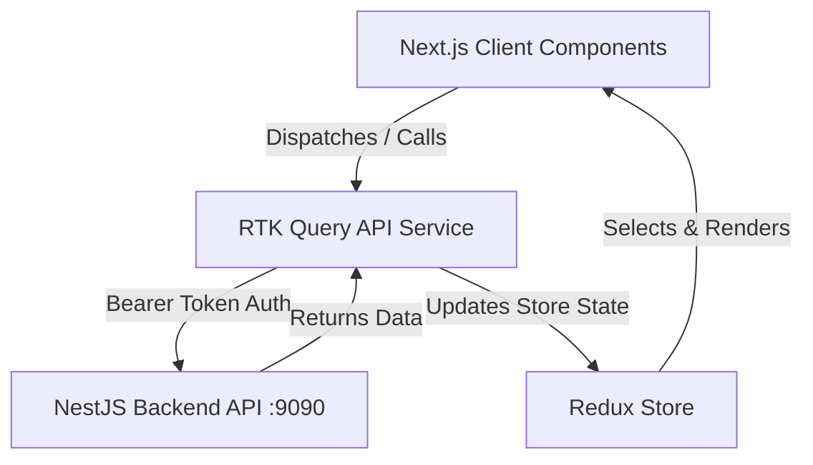

# Architecture Reference: AIMK Admin Panel

This document details the architectural design, directory layout, routing, UI system, and state management for the **aimk_admin** (Angels in My Kitchen Admin Portal) codebase.

---

## 1. Directory Structure

```
aimk_admin/
├── app/                      # Next.js App Router root
│   ├── (auth)/               # Route group for auth pages (Login, Signup)
│   ├── admin/                # Route group for admin dashboard and resource managers
│   │   ├── brands/           # Brand list and edit routes
│   │   ├── categories/       # Category list and edit routes
│   │   ├── products/         # Product list, edit, and create forms
│   │   ├── orders/           # Order list and order detail views
│   │   ├── layout.tsx        # Dashboard layout wrapping sub-views in AdminLayout
│   │   └── page.tsx          # Admin dashboard landing page
│   ├── layout.tsx            # Global HTML wrapper and providers injection
│   └── page.tsx              # Root redirect
├── components/               # Reusable UI component library
│   ├── common/               # General components: CustomFields (form controls), DataTable (wrapper on MUI Data Grid)
│   ├── layout/               # Shell layout: AdminLayout, Navbar, Sidebar
│   └── ui/                   # Modular standalone UI components
├── features/                 # Redux Slices, RTK Query API Services, and pages per entity
│   ├── auth/                 # Auth api service and token validation
│   ├── products/             # Product list state and services
│   ├── categories/           # Category fetch API services
│   ├── realtime/             # Socket.IO client, event contract, and RTK Query cache patching
│   └── ...                   # Brand, discount, orders, payments, media, outlets, legal entities
├── redux/                    # Redux store configuration
│   ├── api.ts                # Map of all RTK Query apiServices
│   ├── reducer.ts            # Dynamic Redux reducer map generation
│   └── store.ts              # Redux store config
├── utils/                    # Global helper utilities and constants (constants.ts)
└── local.sh                 # Environment variables and developer port settings (port: 7070)
```

---

## 2. Core Concepts & Styling

- **Framework**: Next.js 16 (App Router) + React 19.
- **State Management**: Redux Toolkit (RTK) & RTK Query.
  - API services are declared in `features/` (e.g. `authApiService.ts`, `productApiService.ts`).
  - Reducers are compiled dynamically in `redux/reducer.ts` using `Object.fromEntries(Object.values(api).map(...))`.
- **UI Framework**:
  - **Material-UI (MUI)**: Main UI component framework. Highly integrated with `@emotion/react` and `@emotion/styled`.
  - **MUI X-Data-Grid**: Used in `components/common/DataTable.tsx` for listing resources (products, categories, etc.) with sorting, search, and pagination.
  - **MUI X-Date-Pickers**: Used for date selection.
  - **Tailwind CSS v4**: Installed and configured for layout grid adjustments, utilities, and helper classes.
- **Forms**: Managed using **Formik** and validated with **Yup** schemas. See `components/common/CustomFields.tsx` for wrapper inputs (text, select, date, checkbox) bound to Formik context.

---

## 2b. Status Vocabularies (single source per app)

Order and payment status lists are defined once and imported everywhere, after three screens were found shipping three different lists.

- `utils/orderStatus.ts` — mirrors the Prisma `OrderStatus` enum. `ORDER_STATUSES` (ordered by fulfilment lifecycle) and `getOrderStatusConfig()` for labels/chip colours. **`angels/utils/orderStatus.ts` is a byte-identical copy — change both together.**
- `utils/paymentStatus.ts` — mirrors the Prisma `PaymentStatus` enum, plus `isCollectable()` used by the COD flow.
- `components/common/OrderStatusSelect.tsx` — the one status dropdown, used by both the orders grid and the order detail page. Renders an unknown status as a disabled option rather than a blank select.
- Any value outside the Prisma enum is rejected by `PATCH /order/admin/:id/status` with a 500, so these lists must not drift.

## 2c. Order Detail — Payment Panel

- Lists every `Payment` row on the order: amount, status, Razorpay payment/order ids, method (with bank/wallet/VPA), captured & failed timestamps, gateway error, and refund details.
- **Mark Cash Received** calls `POST /payment/collect-cod/:orderId` (`useMarkCodCollectedMutation`) — the only path that captures a COD payment, since cash has no gateway callback. Hidden for online orders and once the payment is captured or refunded.
- Payment mutations invalidate the `Order` tag through `onQueryStarted`; orders are a separate api service with their own tag registry, so `invalidatesTags` alone would not reach them.

## 2a. Realtime Updates (Socket.IO → RTK Query cache)

The Orders and Payments grids update themselves when the backend emits an event. REST is unchanged and remains the only way data is *loaded*; the socket only patches what is already cached.

- **Client**: `features/realtime/socketClient.ts` holds one shared `socket.io-client` connection to `${NEXT_PUBLIC_BASE_API_URL}/realtime`. The auth token is supplied via an `auth` **callback**, so every reconnection attempt re-reads the freshly decrypted token from storage.
- **Contract**: `features/realtime/realtimeEvents.ts` mirrors the backend's constants (rooms, event names, envelope) and provides `createEventDeduper()` — a bounded LRU of `eventId`s that discards redelivered or doubly-sourced events.
- **Provider**: `lib/RealtimeProvider.tsx` (mounted inside `AuthProvider` in `lib/Providers.tsx`) connects only when authenticated, subscribes to the four events, and exposes connection state through `useRealtime()`. On logout it tears the socket down.
- **Cache patching**: `features/realtime/realtimeCache.ts` uses `api.util.selectCachedArgsForQuery(...)` to enumerate every cached `getAllAdminOrders` / `getPayments` entry and applies `api.util.updateQueryData(...)` per entry. **No refetch is issued.** Patching is filter-aware — it mirrors the server `where` clause so a record is only inserted into a cached page it actually belongs to, rows that leave a filter are removed, and `meta.totalItems` / `totalPages` are kept correct. `getAdminOrder` / `getPayment` detail caches are patched too.
- **Token expiry**: access tokens last 15 minutes and the server closes the socket at `exp`. socket.io does *not* auto-reconnect after a server-initiated close, so the provider refreshes the token via `features/realtime/refreshAccessToken.ts` and reconnects with exponential backoff (1s → 15s).
  - That helper is deliberately standalone: importing the RTK Query `baseQuery` here pulls the module into the pre-existing `baseQuery → authSlice → authApiService` import cycle and throws `Cannot access 'baseQueryWithReauth' before initialization` at load time.
- **Gap recovery**: on *re*connect (never on first connect) the provider invalidates the `Order` / `Payment` tags once, so RTK Query refetches only the queries a mounted component is subscribed to. This is the single intentional refetch in the design.
- **Degradation**: if the socket never connects, the grids behave exactly as before — REST load, manual filters, manual refresh. `components/common/RealtimeStatus.tsx` renders a Live/Reconnecting/Offline chip on both pages so the state is visible.

---

## 3. Data Flow & Integration



- **Authentication**: JWT tokens are acquired via the `/auth/login` endpoint and saved securely (using encrypted storage or cookies). The token is verified on initial load via `verifyToken` mutation or `fetchUser` query.
- **API Base**: Target backend runs on `http://localhost:9090` (controlled by `NEXT_PUBLIC_BASE_API_URL` or `NEXT_PUBLIC_BASE_URL`).
- **Media Uploads**: Handled directly using form data. Points to the backend upload endpoint which puts files in S3/SeaweedFS.
