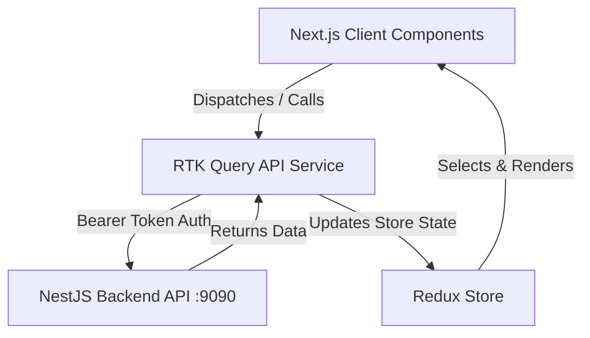

# Architecture Reference: AIMK Admin Panel

This document details the architectural design, directory layout, routing, UI system, and state management for the **aimk_admin** (Angels in My Kitchen Admin Portal) codebase.

---

## 1. Directory Structure

```
aimk_admin/
├── app/                      # Next.js App Router root
│   ├── (auth)/               # Route group for auth pages (Login, Signup)
│   ├── admin/                # Route group for admin dashboard and resource managers
│   │   ├── brands/           # Brand list and edit routes
│   │   ├── categories/       # Category list and edit routes
│   │   ├── products/         # Product list, edit, and create forms
│   │   ├── orders/           # Order list and order detail views
│   │   ├── layout.tsx        # Dashboard layout wrapping sub-views in AdminLayout
│   │   └── page.tsx          # Admin dashboard landing page
│   ├── layout.tsx            # Global HTML wrapper and providers injection
│   └── page.tsx              # Root redirect
├── components/               # Reusable UI component library
│   ├── common/               # General components: CustomFields (form controls), DataTable (wrapper on MUI Data Grid)
│   ├── layout/               # Shell layout: AdminLayout, Navbar, Sidebar
│   └── ui/                   # Modular standalone UI components
├── features/                 # Redux Slices, RTK Query API Services, and pages per entity
│   ├── auth/                 # Auth api service and token validation
│   ├── products/             # Product list state and services
│   ├── categories/           # Category fetch API services
│   └── ...                   # Brand, discount, orders, payments, media, outlets, legal entities
├── redux/                    # Redux store configuration
│   ├── api.ts                # Map of all RTK Query apiServices
│   ├── reducer.ts            # Dynamic Redux reducer map generation
│   └── store.ts              # Redux store config
├── utils/                    # Global helper utilities and constants (constants.ts)
└── local.sh                 # Environment variables and developer port settings (port: 7070)
```

---

## 2. Core Concepts & Styling

- **Framework**: Next.js 16 (App Router) + React 19.
- **State Management**: Redux Toolkit (RTK) & RTK Query.
  - API services are declared in `features/` (e.g. `authApiService.ts`, `productApiService.ts`).
  - Reducers are compiled dynamically in `redux/reducer.ts` using `Object.fromEntries(Object.values(api).map(...))`.
- **UI Framework**:
  - **Material-UI (MUI)**: Main UI component framework. Highly integrated with `@emotion/react` and `@emotion/styled`.
  - **MUI X-Data-Grid**: Used in `components/common/DataTable.tsx` for listing resources (products, categories, etc.) with sorting, search, and pagination.
  - **MUI X-Date-Pickers**: Used for date selection.
  - **Tailwind CSS v4**: Installed and configured for layout grid adjustments, utilities, and helper classes.
- **Forms**: Managed using **Formik** and validated with **Yup** schemas. See `components/common/CustomFields.tsx` for wrapper inputs (text, select, date, checkbox) bound to Formik context.

---

## 3. Data Flow & Integration



- **Authentication**: JWT tokens are acquired via the `/auth/login` endpoint and saved securely (using encrypted storage or cookies). The token is verified on initial load via `verifyToken` mutation or `fetchUser` query.
- **API Base**: Target backend runs on `http://localhost:9090` (controlled by `NEXT_PUBLIC_BASE_API_URL` or `NEXT_PUBLIC_BASE_URL`).
- **Media Uploads**: Handled directly using form data. Points to the backend upload endpoint which puts files in S3/SeaweedFS.
